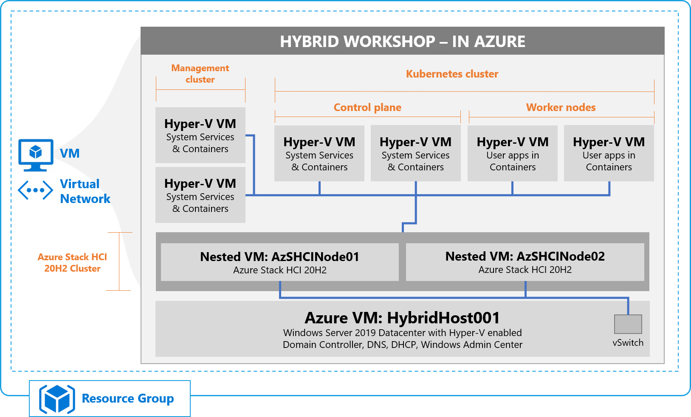

Azure Stack Skilling Workshop
==============

## Welcome to the Azure Stack Skilling Workshop ##

In this workshop, we'll walk you through deploying both [Azure Stack HCI](https://azure.microsoft.com/en-us/products/azure-stack/hci/ "link to the Azure Stack HCI landing page"), and  [Azure Kubernetes Service (AKS) on Azure Stack HCI in an Azure VM](https://docs.microsoft.com/en-us/azure-stack/aks-hci/overview "link to the What is Azure Kubernetes Service on Azure Stack HCI documentation landing page"), and set the foundation for you to explore in your own time.  You'll cover aspects such as:

* Deploying and configuring a Windows Server 2019 Azure VM to host the infrastructure
* Deployment and configuration of a 2-node Azure Stack HCI Cluster using Windows Admin Center
* Deployment of the AKS on Azure Stack HCI management cluster with Windows Admin Center
* Deployment of the AKS on Azure Stack HCI target/workload cluster with Windows Admin Center
* Deployment of a simple test application
* Integrating with Azure Arc
* and more...!

Version
-----------
This guide has been tested and validated with the **September 2021 release** of AKS on Azure Stack HCI, and **Azure Stack HCI 21H2** with the latest updates installed.

Contents
-----------
- [Welcome to the Azure Stack Skilling Workshop](#welcome-to-the-azure-stack-skilling-workshop)
- [Version](#version)
- [Contents](#contents)
- [What is Azure Stack HCI?](#what-is-azure-stack-hci)
- [What is AKS on Azure Stack HCI?](#what-is-aks-on-azure-stack-hci)
- [Why follow this guide?](#why-follow-this-guide)
- [Evaluation using Nested Virtualization](#evaluation-using-nested-virtualization)
- [Deployment Overview](#deployment-overview)
- [Deployment Workflow](#deployment-workflow)
- [Get started](#get-started)
- [Product improvements](#product-improvements)
- [Raising issues](#raising-issues)
- [Credits](#credits)
- [Contributions & Legal](#contributions--legal)

What is Azure Stack HCI?
-----------
Azure Stack HCI 21H2 is a hyperconverged cluster solution that runs virtualized Windows and Linux workloads in a hybrid on-premises environment. Azure hybrid services enhance the cluster with capabilities such as cloud-based monitoring, site recovery, and backup, as well as a central view of all of your Azure Stack HCI 21H2 deployments in the Azure portal. You can manage the cluster with your existing tools including Windows Admin Center, System Center, and PowerShell.

Initially based on Windows Server 2019, Azure Stack HCI 21H2 is now a specialized OS, running on your hardware, delivered as an Azure service with a subscription-based licensing model and hybrid capabilities built-in. Although Azure Stack HCI 21H2 was originally based on the same core operating system components as Windows Server, it's an entirely separate product line focused on being the best virtualization host.

If you're interested in learning more about what Azure Stack HCI 21H2 is, make sure you [check out the official documentation](https://docs.microsoft.com/en-us/azure-stack/hci/overview "What is Azure Stack HCI documentation"), before coming back to continue your workshop experience. We'll refer to the docs in various places in the guide, to help you build your knowledge of Azure Stack HCI 21H2.

What is AKS on Azure Stack HCI?
-----------

If you've landed on this page, and you're still wondering what AKS on Azure Stack HCI is, Azure Kubernetes Service on Azure Stack HCI is an on-premises implementation of Azure Kubernetes Service (AKS), which automates running containerized applications at scale. Azure Kubernetes Service can run on Azure Stack HCI 21H2 and Windows Server 2019 Datacenter-based clusters, making it quicker to get started hosting Linux and Windows containers in your datacenter.

If you're interested in learning more about what AKS on Azure Stack HCI is, make sure you [check out the official documentation](https://docs.microsoft.com/en-us/azure-stack/aks-hci/overview "What is Azure Kubernetes Service on Azure Stack HCI documentation"), before coming back to continue your workshop experience. We'll refer to the docs in various places in the guide, to help you build your knowledge of AKS on Azure Stack HCI.

Why follow this guide?
-----------

This workshop guide will walk you through standing up a sandboxed, isolated Azure Stack HCI and AKS on Azure Stack HCI environment using **nested virtualization** in Azure.  Whilst not designed as a production scenario, the important takeaway here is, by following this guide, you'll lay down a solid foundation on to which you can explore additional scenarios in the future.

Evaluation using Nested Virtualization
-----------

As with any infrastructure technology, in order to test, validate and evaluate the technology, there's typically a requirement for hardware.  If you're fortunate enough to have multiple server-class pieces of hardware going spare (ideally hardware validated for Azure Stack HCI, found on our [Azure Stack HCI Catalog](https://aka.ms/azurestackhcicatalog "Azure Stack HCI Catalog")), you can certainly perform a more real-world evaluation of AKS on Azure Stack HCI. For those that don't have spare hardware, using nested virtualization can be a great alternative for evaluation.

If you're not familiar with nested virtualization, at a high level, it allows a virtualization platform, such as Hyper-V, or VMware ESXi, to run virtual machines that, within those virtual machines, run a virtualization platform. It may be easier to think about this in an architectural view.

As you can see from the graphic, at the base layer, you have physical hardware, onto which you install a hypervisor. In this case, for our example, we're using Windows Server 2019 with the Hyper-V role enabled.  The hypervisor on the lowest level is considered L0 or the level 0 hypervisor.  In Azure, you don't have access or control over this. On that physical host, you create a virtual machine, and into that virtual machine, you deploy an OS that itself, has a hypervisor enabled.  In this example, that 1st Virtualized Layer is running a **nested** operating system with Hyper-V enabled - for instance, this could be Windows Server 2019. This would be an L1 or level 1 hypervisor. Finally, in our example, inside that OS, you could create a virtual machine to run a workload.  This could in fact also contain a hypervisor, which would be known as the L2 or level 2 hypervisor, and so the process continues, with multiple levels of nested virtualization possible.

### Important Note ###
The use of nested virtualization in this workshop guide is aimed at providing flexibility for **evaluating Azure Stack HCI and AKS on Azure Stack HCI in a test environment**, and it shouldn't be seen as a substitute for real-world deployments, performance and scale testing etc. With each level of nesting, comes the trade-off of performance, hence for **production** use, **AKS on Azure Stack HCI should be deployed on validated physical hardware**, of which you can find a vast array of choices on the [Azure Stack HCI 21H2 Catalog](https://aka.ms/azurestackhcicatalog "Azure Stack HCI 21H2 Catalog") or the [Windows Server Catalog](https://www.windowsservercatalog.com/results.aspx?bCatID=1283&cpID=0&avc=126&ava=0&avq=0&OR=1&PGS=25 "Windows Server Catalog") for systems running Windows Server 2019 Datacenter edition.

Deployment Overview
-----------
For those of you who don't have multiple server-class pieces of hardware running Azure Stack HCI 21H2 or Windows Server 2019, this workshop will guide you through deploying an Azure Stack HCI cluster, and AKS on Azure Stack HCI inside an Azure VM, using **nested virtualization**.

In this configuration, you'll take advantage of the nested virtualization support provided within certain Azure VM sizes. You'll first deploy a single Azure VM running Windows Server 2019 Datacenter. Inside this VM, you'll configure an Azure Stack HCI cluster and go on to deploy the AKS on Azure Stack HCI management cluster, and worker node clusters. All of this, in a single Azure VM.

### Important Note ###
The steps outlined in this guide are **specific to running inside an Azure VM**. If you plan to use these steps in an alternative environment, such as one nested/physical on-premises, the steps may differ and certain procedures may not work. If that is the case, please refer to our official documentation.

Deployment Workflow
-----------
This guide will walk you through deploying a sandboxed infrastructure. To accommodate different preferences, we've provided paths for those of you who prefer PowerShell, or GUI (Graphical User Interface, such as Windows Admin Center)-based deployments.

The general flow will be as follows:

**Part 1 - Complete the pre-requisites - deploy your Azure VM**: In this step, you'll create a VM in Azure using an Azure Resource Manager template. This VM will run Windows Server 2019 Datacenter, with the full desktop experience. PowerShell DSC will automatically configure this VM with the appropriate roles and features, download the necessary binaries, and configure 2 Azure Stack HCI 21H2 nodes, ready for clustering.

**Part 2 - Configure your Azure Stack HCI 21H2 Cluster**: In this step, you'll use **Windows Admin Center** to deploy an Azure Stack HCI 21H2 cluster - along with a File Share Witness, a Cluster Shared Volume, and finally, you'll register this cluster with Azure.

**Part 3 - Integrate Azure Stack HCI 21H2 with Azure**: In this step, you'll use **Windows Admin Center** to register your Azure Stack HCI Cluster with Azure and explore what's presented in the portal

**Part 4 - Deploy your AKS-HCI infrastructure**: In this step, you'll use **Windows Admin Center** to deploy AKS on Azure Stack HCI - this will consist of first deploying the necessary management cluster, then followed by a target cluster, for running workloads.

**Part 5 - Explore AKS on Azure Stack HCI Environment**: With your deployment completed, you're now ready to explore many of the aspects within AKS on Azure Stack HCI. We'll also provide links to further scenarios and resources to continue your learning.

Get started
-----------

* [**Part 1** - Complete the prerequisites - deploy your Azure VM](/steps/1_DeployAzureVM.md "Complete the prerequisites - deploy your Azure VM")
* [**Part 2** - Configure your Azure Stack HCI 21H2 Cluster](/steps/2_DeployAzSHCI.md "Configure your Azure Stack HCI 21H2 Cluster")
* [**Part 3** - Integrate Azure Stack HCI 21H2 with Azure](/steps/3_AzSHCIIntegration.md "Integrate Azure Stack HCI 21H2 with Azure")
* [**Part 4** - Integrate Azure Stack HCI 21H2 with Azure](/steps/4_ExploreAzSHCI.md "Explore Azure Stack HCI 21H2")
* [**Part 5** - Deploy your AKS-HCI infrastructure](/steps/5_DeployAKSHCI.md "Deploy your AKS-HCI infrastructure")
* [**Part 6** - Explore the AKS on Azure Stack HCI Environment](/steps/5_ExploreAKSHCI.md "Explore the AKS on Azure Stack HCI Environment")

Product improvements
-----------
If, while you work through this guide, you have an idea to make the product better, whether it's something in Azure Stack HCI, AKS on Azure Stack HCI, Windows Admin Center, or the Azure Arc integration and experience, let us know! We want to hear from you!

For **Azure Stack HCI**, [Head on over to the Azure Stack HCI 21H2 Q&A forum](https://docs.microsoft.com/en-us/answers/topics/azure-stack-hci.html "Azure Stack HCI 21H2 Q&A"), where you can share your thoughts and ideas about making the technologies better and raise an issue if you're having trouble with the technology.

For **AKS on Azure Stack HCI**, [Head on over to our AKS on Azure Stack HCI GitHub page](https://github.com/Azure/aks-hci/issues "AKS on Azure Stack HCI GitHub"), where you can share your thoughts and ideas about making the technologies better. If however, you have an issue that you'd like some help with, read on... 

Raising issues
-----------
If you notice something is wrong with this guide, such as a step isn't working, or something just doesn't make sense - help us to make this guide better!  Raise an issue in GitHub, and we'll be sure to fix this as quickly as possible!

If you're having an issue with Azure Stack HCI 21H2 **outside** of this guide, [head on over to the Azure Stack HCI 21H2 Q&A forum](https://docs.microsoft.com/en-us/answers/topics/azure-stack-hci.html "Azure Stack HCI 21H2 Q&A"), where Microsoft experts and valuable members of the community will do their best to help you.

If you're having a problem with AKS on Azure Stack HCI **outside** of this guide, make sure you post to [our GitHub Issues page](https://github.com/Azure/aks-hci/issues "GitHub Issues"), where Microsoft experts and valuable members of the community will do their best to help you.

Credits
-----------
Major kudos to **Yagmur Sahin** for his work on his [Azure Stack HCI](https://github.com/yagmurs/AzureStackHCIonAzure "Yagmur's Azure Stack HCI on Azure project") and [AKS-HCI on Azure](https://github.com/Azure/AksHcionAzureVM "Yagmur's AKS-HCI on Azure project") projects - without his hard work as a starting point, I'd never have been able to put all of this together, so kudos to Yagmur - amazing work!

Contributions & Legal
-----------

### Contributing ###
This project welcomes contributions and suggestions.  Most contributions require you to agree to a Contributor License Agreement (CLA) declaring that you have the right to, and actually do, grant us the rights to use your contribution. For details, visit https://cla.opensource.microsoft.com.

When you submit a pull request, a CLA bot will automatically determine whether you need to provide a CLA and decorate the PR appropriately (e.g., status check, comment). Simply follow the instructions provided by the bot. You will only need to do this once across all repos using our CLA.

This project has adopted the [Microsoft Open Source Code of Conduct](https://opensource.microsoft.com/codeofconduct/).
For more information see the [Code of Conduct FAQ](https://opensource.microsoft.com/codeofconduct/faq/) or
contact [opencode@microsoft.com](mailto:opencode@microsoft.com) with any additional questions or comments.

### Legal Notices ###

Microsoft and any contributors grant you a license to the Microsoft documentation and other content in this repository under the [Creative Commons Attribution 4.0 International Public License](https://creativecommons.org/licenses/by/4.0/legalcode), see the [LICENSE](LICENSE) file, and grant you a license to any code in the repository under the [MIT License](https://opensource.org/licenses/MIT), see the [LICENSE-CODE](LICENSE-CODE) file.

Microsoft, Windows, Microsoft Azure and/or other Microsoft products and services referenced in the documentation may be either trademarks or registered trademarks of Microsoft in the United States and/or other countries. The licenses for this project do not grant you rights to use any Microsoft names, logos, or trademarks. Microsoft's general trademark guidelines can be found at http://go.microsoft.com/fwlink/?LinkID=254653.

Privacy information can be found at https://privacy.microsoft.com/en-us/

Microsoft and any contributors reserve all other rights, whether under their respective copyrights, patents, or trademarks, whether by implication, estoppel or otherwise.
